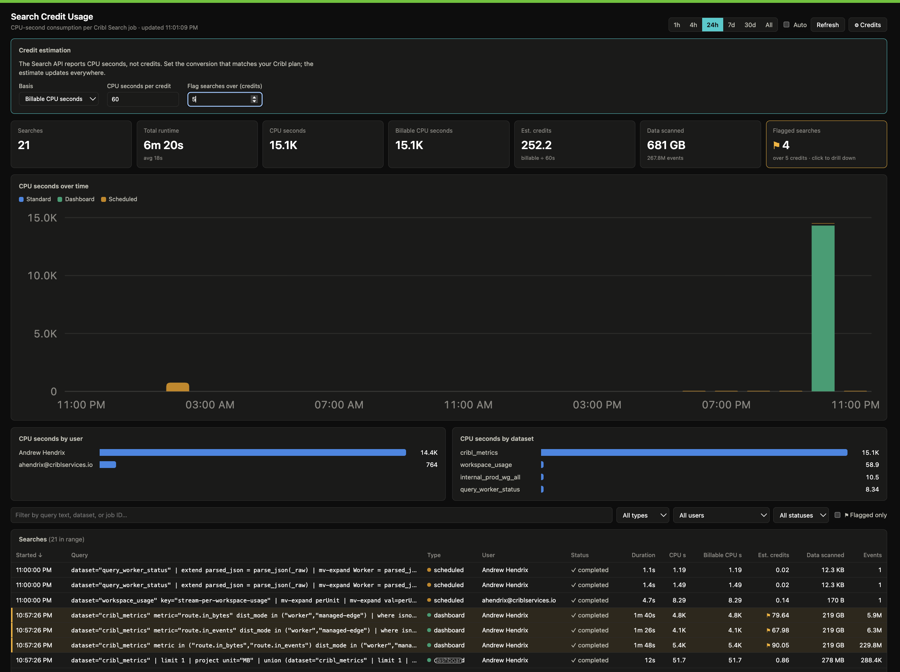

# Search Credit Usage

A [Cribl App](https://docs.cribl.io/apps) that shows credit/CPU consumption per Cribl Search job — like the built-in Search monitoring dashboard, but focused on what each search costs.



## Features

- **Usage stat tiles** — search count, total/average runtime, CPU seconds, billable CPU seconds, estimated credits, and data/events scanned for the selected time range.
- **CPU seconds over time** — stacked column chart broken down by search type (standard / dashboard / scheduled) with hover tooltips.
- **Breakdowns** — top consumers by user and by dataset.
- **Searches table** — every job with duration, CPU s, billable CPU s, estimated credits, data scanned, and events; sortable columns and filters for query text, type, user, and status.
- **Credit flagging** — set a credit threshold in the ⚙ Credits panel; searches over it are flagged with a warning stripe, counted in a "Flagged searches" tile, and can be isolated with one click.
- **Drilldown** — click the Flagged tile to jump to flagged searches, and click any row for full details: complete query text, timestamps, search window, datasets, launch time, data/events scanned, per-executor CPU breakdown, and an "Open in Cribl Search" link.
- **Time ranges & refresh** — 1h / 4h / 24h / 7d / 30d / All presets, manual refresh, and optional 60-second auto-refresh.

## How it works

The app runs inside the Cribl App Platform (sandboxed iframe; the platform proxies and authenticates all API calls). It reads:

| Endpoint | Used for |
|---|---|
| `GET /m/default_search/search/jobs` | Job list with `cpuMetrics` (total/billable/per-executor CPU seconds), status, user, type, timestamps. Paginated with `limit`/`offset`, sorted by `timeCreated`. |
| `GET /m/default_search/search/job-metrics` | Per-job bytes/events scanned and launch timing (Cribl.Cloud only; the app degrades gracefully without it). |

Both paths are declared in [`config/policies.yml`](config/policies.yml).

### Credit estimation

The Search API reports **CPU seconds**, not credits. The ⚙ Credits panel lets you set the conversion that matches your Cribl plan:

- **Basis** — billable CPU seconds (default) or total CPU seconds (useful in dev environments where coordinator-only searches report 0 billable).
- **CPU seconds per credit** — default 60.
- **Flag threshold** — flag any search whose estimated credits exceed this value.

Settings persist in the browser via `localStorage`.

## Development

```bash
npm install
npm run dev       # live preview
npm run lint      # oxlint
npm run build     # type-check + production build
npm run package   # build + create installable app archive (bumps version)
```

Built with React 19, TypeScript, and Vite. Charts are hand-rolled SVG — no chart library.

To install in Cribl: run `npm run package` and upload the generated archive to your Cribl workspace.
